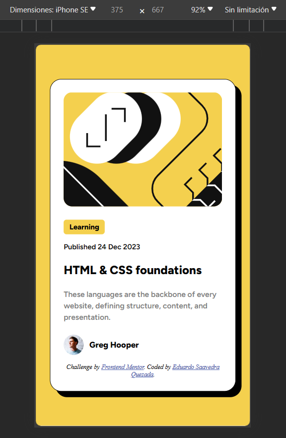

# Frontend Mentor - Blog preview card solution

This is a solution to the [Blog preview card challenge on Frontend Mentor](https://www.frontendmentor.io/challenges/blog-preview-card-ckPaj01IcS). Frontend Mentor challenges help you improve your coding skills by building realistic projects. 

## Table of contents

- [Overview](#overview)
  - [The challenge](#the-challenge)
  - [Screenshot](#screenshots)
  - [Links](#links)
- [My process](#my-process)
  - [Built with](#built-with)
  - [What I learned](#what-i-learned)
  - [Continued development](#continued-development)
  - [Useful resources](#useful-resources)
- [Author](#author)

## Overview

### The challenge

Users should be able to:

- See hover and focus states for all interactive elements on the page

### Screenshots

#### Desktop


##### Desktop Active States


#### Mobile 1


#### Mobile 2


#### Mobile Active States


### Links

- Solution URL: [Add solution URL here](https://your-solution-url.com)
- Live Site URL: [Add live site URL here](https://your-live-site-url.com)

## My process

### Built with

- Semantic HTML5 markup
- CSS custom properties
- Flexbox
- Mobile-first workflow

### What I learned

This was the second challenge that I tried. I'm keep practicing flexbox because I think it is a powerful tool that is essential to
master.

The hardest part was to select the appropriate tags on the html document. It want to avoid the excesive use of div and span but sometimes Im not sure if this part needs to be inside of the header tag or the main tag.

```html
<header>
  
  <h1><span>Learning</span></h1>

  <p>Published <time datetime="2023-12-24">24 Dec 2023</time></p>
</header>

<main>
  <h2>HTML & CSS foundations</h2>

  <p>These languages are the backbone of every website, defining structure, content, and presentation.</p>
</main>
```

### Continued development

Besides what I mentined above, I want to keep working on responsive design. I want to use media querys only when they're neccesary.

### Useful resources

- [w3schools HTML tutorial](https://www.w3schools.com/html/default.asp)
- [w3schools CSS tutorial](https://www.w3schools.com/css/default.asp)

## Author

- GitHub - [@EduardoSaavedraQ](https://github.com/EduardoSaavedraQ)
- Frontend Mentor - [@EduardoSaavedraQ](https://www.frontendmentor.io/profile/EduardoSaavedraQ)